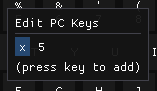

Work in progress updated docs. See
https://github.com/tom-seddon/b2/issues/183

# b2

Use b2 to get your modern system running software for the BBC Micro
(B/B+), BBC Master 128, BBC Master Compact or Olivetti PC 128 S! It
will run old games, applications and ROMs, and comes with debugging
tools to help with reverse-engineering existing code or developing new
software.

b2 runs on Windows, macOS and Linux.

The b2 manual will take you on a tour of the available facilities, and
there will be pictures. Most screen grabs are taken from the Windows
version, but if you use macOS or Linux, don't worry - the UI is pretty
much the same on all platforms.

# Running BBC games

BBC Micro games usually come as disk images, typically .ssd (single
sided, single density) or .dsd (double sided, single density). Game
disks are usually auto booting, and you can run them from b2 using
`File` \> `Run` \> `Disc image...`.

Select a disk image using the file selector. (A good place to find
games would be https://bbcmicro.co.uk/)

The disk should boot, and the game should run.

# Keyboard layout

The BBC Micro keyboard looks like this. Not quite the same as a modern
one!

By default, alphabetic keys map directly to their BBC equivalents.

Number keys map directly to their unshifted BBC equivalents.
Shift+number gets you the BBC shifted version - so shift+9 gives you
`)` (as per the BBC keyboard) rather than `(` (as on a modern
keyboard).

Escape, Tab, Caps Lock, Ctrl, Shift, Return and cursor keys map
directly to the BBC equivalents.

Backspace maps to BBC Delete, Scroll Lock maps to BBC Shift Lock, and
End maps to BBC Copy.

Symbol keys are as follows, assuming a UK layout PC keyboard. Most of
these are hopefully unsurprising.

| Key | BBC Key |
|-----|---------|
| ,   | ,       |
| .   | .       |
| /   | /       |
| ;   | ;       |
| '   | :       |
| [   | [       |
| ]   | ]       |
| =   | _       |
|-----|---------|
| `   | ^       |
| #   | @       |
| \   | \       |

If you have a US layout PC keyboard, some of the keys aren't the same.

| Key  | BBC Key |
|------|---------|
| \    | @       |
| Home | \       |

This arrangement is intended to keep most keys in about the same place
physically, the goal being to have it work reasonably well for games.
 
# Alternative keyboard layouts

There are three other keyboard layouts available on the `Keyboard`
menu.

## `Default (caps/ctrl)`

This is very similar to the default layout, but with a slight tweak to
make it easier to play games that use some combination of Caps Lock,
Ctrl or A for movement.

Left Ctrl maps to BBC Caps Lock and Left Alt maps to BBC Ctrl, to
accommodate games that use Caps Lock and Ctrl.

Caps Lock maps to BBC Ctrl, to accommodate games that use Ctrl and A.

## `Default UK`

This layout works a bit differently, in that it goes by characters
rather than keys. (This is indicated by the little `A` marker by its
name. Ordinary key-based keymaps have a keyboard type icon.) For
example, if you press Shift+0, producing `)` on a modern keyboard, the
emulator will pretend that you pressed Shift+9 on the BBC keyboard,
producing `)`.

## `Default US`

Similar to Default UK, but with a couple of tweaks to make it work
better with an standard ANSI-type US layout keyboard.

# Design your own keyboard layout

Use `Keyboard` > `Keyboard Layouts` to bring up the Keyboard Layouts
dialog. As with all b2 dialogs, it's resizable, which is lucky because
this one needs to be quite wide.

The list on the left lets you select the keyboard layout to edit. Edit
one of the existing ones, or use the `New...` and `Copy...` buttons to
create a new one. `New...` will create a new layout that's a copy of
one of the 4 built-in default ones, and `Copy...` will create a new
layout that's a copy of one of the (possibly modified) current ones.

Click `Delete` (a destructive action that needs confirmation) to
delete the currently selected layout. (Don't worry about deleting one
of the built-in layouts; you can always get it back with the `New...`
button.)

If the BBC display has focus, you'll see the current BBC key states
reflected in the Keyboard Layouts dialog; if the Keyboard Layouts
dialog has focus, for technical reasons this only happens for
key-based keymaps.

Click on the `Name` box at the top to edit the keymap's name.

Click `Prioritize command keys` to have keyboard shortcuts for the b2
UI take priority over BBC Micro input. (If you don't tick this, you
can still enable it later on an ad-hoc basis.)

Mouse over a BBC key to see the PC keys that map to this one.

If you're looking at a character-based keymap, some keys are split
into two halves, corresponding to unshifted (lower) and shifted
(upper).

Click on the key to edit the mapping. The PC keys popup will prompt
you to press a key to add it to the list of PC keys that correspond to
this BBC key, which you can do.

Alternatively, click the `X` button next to a key to remove it from
the list, or click outside the popup to cancel the editing for this
key. (There are no keyboard shortcuts for either of these. All
keyboard input is treated as specifying the PC keys to use.)

# Basic UI notes

For technical reasons, the b2 UI is a little idiosyncratic. Here's
some notes about how it works.

When you first launch b2, you'll be confronted with the b2 window.

Try typing some stuff. The emulated BBC Micro will receive your input
and respond in the usual fashion.

There's a menu bar along the top of the window contents. Click on a
menu and it'll drop down in a fairly standard fashion. Try going to
the `Tools` menu and clicking `Options` (this action is also known as
`Tools` > `Options`). The options dialog will appear.

Move the dialog by clicking and dragging on its title bar or some
empty-looking part of its contents. Note the docking prompts shown
while doing this, indicating that dialogs can be docked to an edge of
the window.

Drag and drop the dialog onto one of the docking prompts and it will
dock itself into that part of the window. The emulated BBC display
will resize itself to fit into the remaining space.

Now try doing `Tools` > `Messages`. The messages dialog will appear,
and it can also be docked to an edge of the overall window - or added
as a tab to one of the existing docked dialogs, or docked to an edge
of one of the existing docked dialogs or the BBC display. This is true
of all dialogs, and you can use this to arrange them into whatever
layout feels most useful. The BBC display will always fit itself into
whatever space is left over.

The dialog layout and sizes/positions are persistent.

You can close a dialog by clicking on its `X` button in the top right,
or by activating its menu option again. The menu option is ticked when
the dialog is visible.

There are no yes/no/ok/cancel-type dialogs in the b2 UI, that wait for
you to confirm a destructive action. Destructive actions such as
`File` > `Exit` produce a popup or submenu with a `Confirm` item that
you need click to confirm the action.
