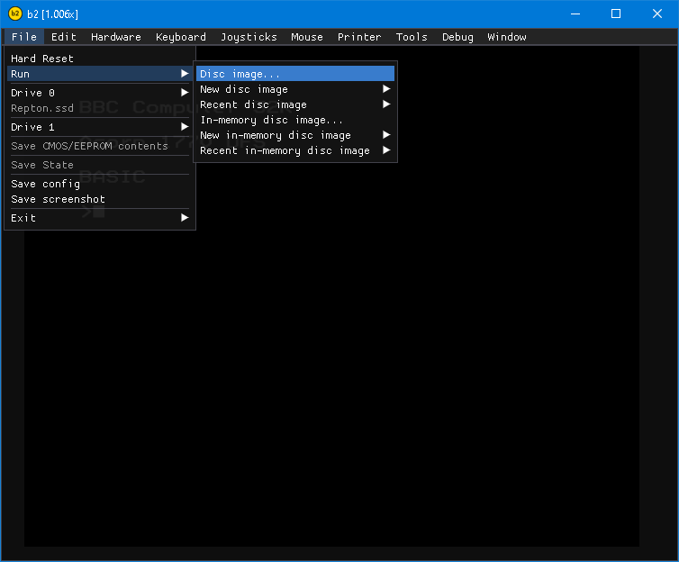
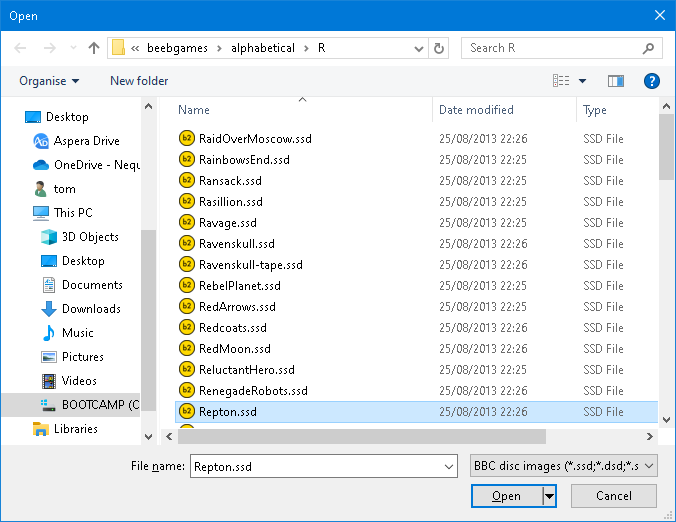
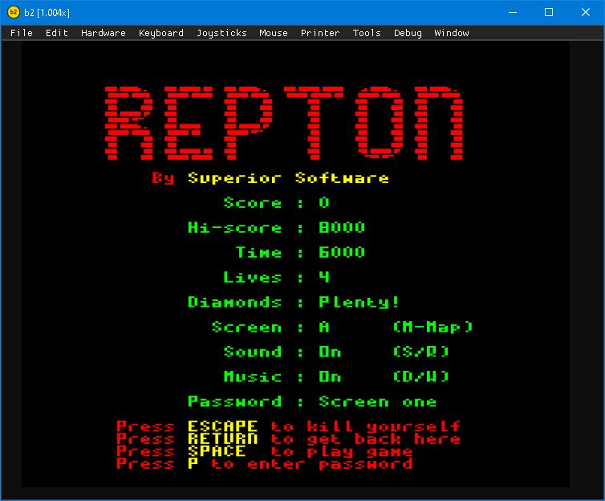

Work in progress updated docs. See
https://github.com/tom-seddon/b2/issues/183

# b2

b2 lets you run BBC Micro and Electron software on your modern system:
Windows, macOS, or Linux. Use it to run old games, applications and
ROMs. It also includes debugging features to help reverse engineer
existing code or develop new software.

IMAGE: b2 running something

To install and run, follow the relevant system-dependent installation
instructions:

* [Install on Windows](./install_on_windows.md)
* [Install on macOS](./install_on_macos.md)
* [Install on Linux](./install_on_linux.md)

# b2 documentation

The b2 documentation covers use of the emulator.

* [Walkthrough of some of b2's features](./walkthrough.md)
* [Some notes about b2's UI](./ui.md)
* [Keyboard layouts](./keyboard.md)
* [Configuring emulated hardware](./configs.md)

# BBC documentation

## BBC B/B+

* [BBC Micro User Guide](https://stardot.org.uk/forums/viewtopic.php?t=14024)
* [Disc Filing System User Guide](https://github.com/bitshifters/bbc-documents/blob/master/FS/Acorn_DiscSystemUGI2.pdf)

## BBC Master 128

* [BBC Master Reference Manual](https://stardot.org.uk/forums/viewtopic.php?f=42&t=20466)

## BBC Master Compact/Olivetti PC 128 S

* [Master Compact Welcome Guide](https://8bs.com/othrdnld/manuals/hnooijen/Acorn/Master-Compact-Welcome-Guide.pdf)
* [Guida all'uso del sistema PC 128 S](https://github.com/bitshifters/bbc-documents/blob/master/MasterCompact/PC128S_welcome.pdf) (Italian)

## Acorn Electron

* [Electron User Guide](https://github.com/bitshifters/bbc-documents/blob/master/Electron/Electron%20User%20Guide.PDF)
* [Electron Plus 1 User Guide](https://github.com/bitshifters/bbc-documents/blob/master/Electron/Acorn_Plus1UG.pdf)
* [Electron Plus 3 User Guide](https://github.com/bitshifters/bbc-documents/blob/master/Electron/Acorn_Plus3UG.pdf)

## Peripherals

Documentation applicable to multiple models.

* [Winchester Disc Filing System User Guide](https://github.com/bitshifters/bbc-documents/blob/master/Hard%20Disk/Acorn_WinchesterDiscFilingSystemUG.pdf) - hard disks in general
* [6502 second processor User Guide](https://github.com/bitshifters/bbc-documents/blob/master/Tube/Acorn_65022ndprocUG.pdf) - external 6502 second processor
* [65C102 Co-Processor User Guide](https://github.com/bitshifters/bbc-documents/blob/master/Tube/Acorn_65C102CoProUG.pdf) - Master Turbo

## Programming manuals

These were unofficial, but widely used. 

* [Advanced User Guide](https://stardot.org.uk/forums/viewtopic.php?f=42&t=17242) (BBC B, but much of the info also applies to BBC B+/Master)
* [New Advanced User Guide](https://stardot.org.uk/forums/viewtopic.php?f=42&t=17243) (BBC B/B+/Master)
* [Advanced Master Reference Manual](https://stardot.org.uk/forums/viewtopic.php?t=21734) (BBC Master)
* [Electron Advanced User Guide](https://stardot.org.uk/forums/viewtopic.php?t=23193) (Acorn Electron)

# Running BBC games

BBC Micro games usually come as disk images, typically .ssd (single
sided, single density) or .dsd (double sided, single density). Game
disks are usually auto booting, and you can run them from b2 using
`File` \> `Run` \> `Disc image...`.

Select a disk image using the file selector. (A good place to find
games would be https://bbcmicro.co.uk/)

The disk should boot, and the game should run.

