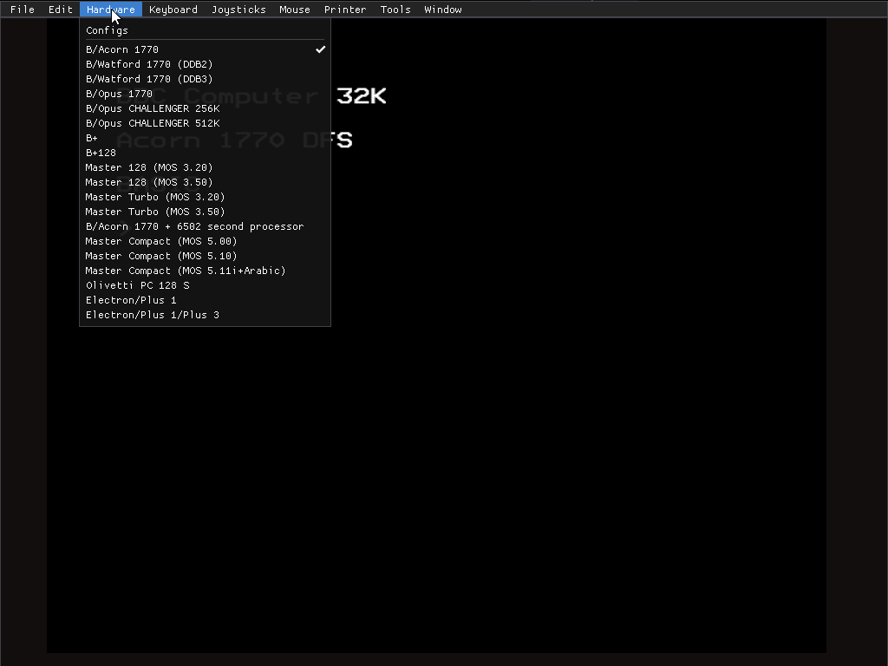
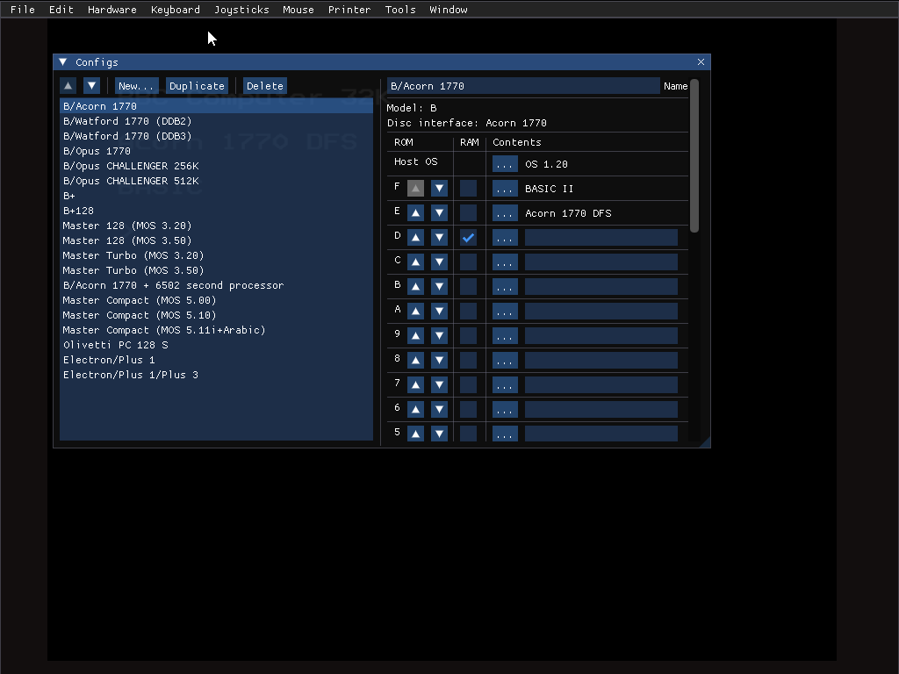
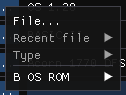
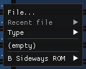
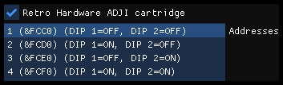
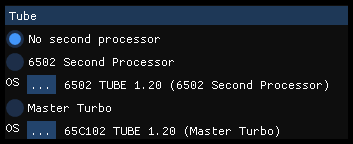
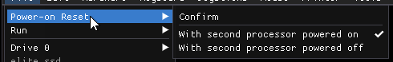
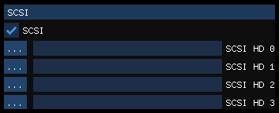
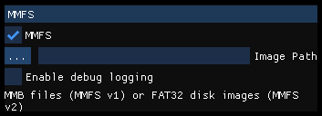

b2 starts up emulating a BBC Micro model B with OS 1.20, BASIC II,
Acorn 1770 DFS, and 16 KB sideways RAM.

Drop down the Hardware menu to get a list of other possible setups.

(See [the default configs list](./default_configs.md) for a description
of exactly what each entry in the default list contains.)

Select one to have the existing emulated machine replaced with a new
one of the corresponding type.

# Modifying configurations

The default configurations are just there to get you started. You can
change the settings for each one, rename and reorder them, and add to
or remove from the list.

Click `Configs` to bring up the hardware configuration dialog.

The dialog is divided into two parts. On the left, a list of all the
possible configurations, as seen in the `Hardware` menu; on the right,
the settings for the selected configuration.

# Modify the list

Use the up and dowm arrow buttons to move the current configuration up
or down in the list, configuring the order they're shown in the menu.
Click `Delete` to remove a configuration from the list.

Click `Duplicate` or `New...` to create a new configuration.
`Duplicate` creates a copy of an existing one in the list, and
`New...` creates a new one that's a copy of one of the defaults.

# Modify a configuration

## Name

Use the `Name` text box to edit the name shown in the menu. Note that
each configuration's name must be unique, and b2 will add a numeric
suffix to enforce this if required.

(If you don't want the numeric suffix, edit the name of the other
keymap to remove the conflict, then delete the suffix.)

## Model and disk interface

The basic hardware type and disk interface are fixed for each
configuration, and shown in the UI by the `Model` and `Disc interface`
entries for informational purposes only.

If you'd like some other model or disk interface, select one of the
other configurations.

## ROMs

The ROMs section shows the OS ROM, and the 16 sideways ROM banks
(numbered in hex: F to 0).

Every ROM, OS or sideways, has a `...` button. Click on it to bring up
a popup menu that'll let you configure its contents. Example popups:

Click `File...` to select a file from disk, or `Recent file` to pick a
file previously selected that way. Then use `Type` to bring up a
submenu with options for the ROM type: the default type, `16 KB`, will
be good in most cases, but there are multiple types of [OS
ROMs](./os_rom_types.md) and [sideways ROMs](./sideways_rom_types.md),
so you may need to select another option.

For sideways ROM banks, Use `(empty)` to empty the ROM bank.

Use one of the additional options in the bottom section of the popup
to pick one of the [built-in ROM images that come with
b2](./built_in_rom_images.md). b2 will only show you ROMs relevant for
the selected ROM type and config. (The `Type` submenu will become
disabled in this case; b2 already knows the correct type for each of
the the built-in ROM images.)

### Sideways ROMs

Sideways ROMs have a couple of extra widgets that the OS ROM doesn't.

Tick the box in the `RAM` column to have this bank be sideways RAM.

Use the up and down arrows to move the sideways ROM row up or down,
changing the relative priority of the ROMs.

Depending on hardware type, some sideways ROM banks may be
unavailable.

**NOTE**: it is currently possible to create some types of
configuration that would actually be impossible. (For example, you can
have a Master 128 with sideways RAM in bank 14.) You may wish to bear
this in mind when configuring your emulated BBC Micro.

## Additional hardware

### Video NuLA _(not Electron)_

Tick the box to add a [Video
NuLA](https://stardot.org.uk/forums/viewtopic.php?t=12150), providing
4096 colour output, smooth scrolling, and some additional screen
modes.

### Retro Hardware ADJI cartridge _(Electron/Master 128 only)_

Tick the box to add a Retro Hardware joystick interface cartridge, a
remake of the [Slogger Switched Joystick
Interface](https://www.computinghistory.org.uk/det/32296/Slogger%20Switched%20Joystick%20Interface/).
Select the DIP switch setting from the list box.

(The emulated ADJI doesn't occupy a cartridge slot from the sideways
ROM perspective, so you don't lose any ROM slots if enabling it.)

### Mouse _(B/B+/Master 128 only)_

Add an AMX-/Watford-type mouse, connected to the user port.

### ROM board _(B only)_

Tick the box to add a 16 socket ROM board - which is the default
setting, as it's much more useful.

When unticked, only sideways ROM banks C, D, E and F are available,
and selecting other banks wlil read from one of them. (This
corresponds to the default model B setup, with the 4 onboard ROM
sockets only.)

### Serial _(Master Compact only)_

Tick the box to add the optional serial hardware upgrade to the Master
Compact.

### Plus 3 _(Electron only)_

Tick the box to add a Plus 3 disk interface.

### BeebLink

Enable support for BeebLink, a BBC file storage system with a PC-based
file server designed to make it easy for BBC and PC to share files.
See [the BeebLink docs](./beeblink.md).

### External memory _(B/B+/Master 128 only)_

Add a 16 MByte paged RAM 1 MHz bus device.

Paging registers are at &FC00 (LSB) and &FC01 (MSB), selecting which
of the 65536 pages become accessible in page &FD.

If using BBC B: the external RAM can't be enabled if the configuration
includes the Opus Challenger.

### Extra debugging hardware _(b2 with debugger only)_

Add extra debugging-related emulated hardware, accessible to code
running in the emulator. For more info, see [the debugger
documentation](./debugger.md).

## Tube _(B/B+/Master 128/Electron only)_

Select a second processor.

- `No second processor` - no second processor installed
- `6502 Second Processor` - a 3 MHz external 6502 Second Processor
  will be installed
- `Master Turbo` - a 4 MHz Master Turbo board will be installed
  (internally, for Master 128; otherwise, externally)

Use the `...` button to select the OS for the second processor. As
with other types of ROM, you can pick a file (max 4 KB, loaded so its
last byte ends up at address $ffff), a recent file, or one of the
built-in 6502 second processor OS ROMs.

Please note any notes provided in the UI regarding activating the
second processor. For B/B+/Electron, a ROM with the Tube interface
code needs to be installed; for the Master 128, support is built in to
the MOS, but the relevant `*CONFIGURE` option must be set for it to
activate the second processor. (See: Master Reference Manual, part 1,
page C.5-2 and following; 65C102 Co-processor User Guide, p 6.)

### Powering on/off an external second processor

This option doesn't apply to the Master 128 with Master Turbo. The
Master Turbo is connected internally and is therefore always powered.

For all other cases, the `File` > `Power-on reset` will gain 2
additional options: one to reset with the 6502 second processor on,
and one to reset with it off. (The ticked entry indicates the current
state.)

The usual `Confirm` entry will do a power-on reset with the current
state.

## SCSI _(B/B+/Master 128/Electron only)_

Tick `SCSI` to add an emulated SCSI hard disk adapter, compatible with
the Acorn ADFS in any of the default Master 128 or Master Turbo
configs, or the Electron/Plus 1/Plus 3 config.

Up to four hard disk images can be selected, corresponding to ADFS
drives 0-4. See [the SCSI documentation](./scsi.md) for more about BBC
hard disk images, including how to create new ones.

When using hard disks in the emulator, be sure to use `*BYE` (see
Master Reference Manual J.7-4; Electron Plus 3 User Guide p 42),
`*CLOSE` (see Master Reference Manual G.5-3; Electron Plus 3 User
Guide p 42), or `*DISMOUNT` (see Master Reference Manual p J.7-7;
Electron Plus 3 User Guide p 46) as required. The emulator will write
data to the disk image file only when ADFS requests it!

## MMFS

Tick `MMFS` to add an emulated MMFS SD card adapter, compatible with
any of the emulated types of BBC Micro.

See [the MMFS documentation](./mmfs.md) for more about MMFS and how to
use it with b2.
