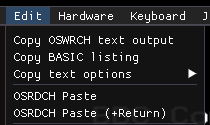

b2 has various features for copying text output from the BBC to the
clipboard, or pasting clipboard text into the BBC. Find them on the
`Edit` menu.

# Copy text

## Copy text output

Click `Copy OSWRCH text output` to start capturing characters copied
by the `OSWRCH` OS routine.

Once started, the option will become ticked, indicating that the
characters are being captured and stored. Click it again to end the
capture and copy the buffered-up results to the clipboard.

It's explicitly described as "text output", because it strips out VDU
control codes, normalizes line endings, and discards any chars with an
ASCII value over 128. You stand a good chance of being able to paste
the result into a word processor or text editor or what have you.

Characters may be translated, as per the options below.

## Copy BASIC listing

Click `Copy BASIC listing` at the BASIC prompt to copy the current
listing to the clipboard.

This facility only works at the BASIC prompt!

This reuses the `Copy text output` mechanism (see above) - the same
notes apply. If the code has teletext control codes or VDU command
codes embedded in strings, it won't copy correctly.

## Copy text options

Tick one of the character translation options:

- `No translation` - characters are passed through as-is
- `Translate £ only` - BBC ASCII 96 (`£`) will be converted to Unicode
  U+00A3 POUND SIGN
- `Translate Mode 7 chars` - convert £ as above, and also [convert
  chars so they resemble the Mode 7 character set](./mode_7_chars.md)

When `Handle delete` is ticked (which is the default setting), the
emulator will try to handle delete (ASCII 127) chars properly, by
removing the deleted char from the copied data. This can't handle
every possible case perfectly, but it'll do the right thing for
copying stuff typed in at the BASIC prompt.

(With `Handle delete` unticked, the copied data will include every
character, plus any ASCII 127 chars. This typically isn't what you
want - but, if it is, you can have it.)

# Paste text

Click `OSRDCH Paste` to paste text from the clipboard into BASIC,
either at the BASIC prompt (if you're pasting in a program with line
numbers, or a sequence of instructions), or after doing `AUTO` (if
you're pasting in a program without line numbers).

Its companion, `OSRDCH Paste (+Return)`, does exactly the same thing,
and then always adds a Return press at the end - since sometimes when
copying text, it doesn't end with a newline.

This is intended for pasting in BASIC listings at the BASIC prompt.
But it hooks into a standard OS routine for reading keyboard input
(`OSRDCH` - hence the name), so you may find it works in other
programs as well.

The corresponding menu option will be ticked while the paste operation
is ongoing. You can click it again to cancel the paste.

## Errors

If there's an error during the paste - e.g., because there was a
syntax error in a line of BASIC - the paste will still continue.
Please exercise due caution.

## Character translation

Some characters are translated, to make this work well when pasting
text from modern applications:

- Any newlines in the pasted text (`CF LF`, `LF CR`, `LF`, `CR`) are
  translated into BBC ASCII 13, corresponding to a press of Return
- `£` (Unicode U+00A3 POUND SIGN) is translated into BBC ASCII 96,
  which is `£` on the BBC Micro
- [Mode 7 characters](./mode_7_chars.md) from the `Translate Mode 7
  chars` (see `Copy text options` above) set will be converted to the
  corresponding BBC ASCII chars
  
And, also, it's strictly speaking not a translation, but: `` ` ``
(Unicode U+0060 GRAVE ACCENT) comes through as BBC ASCII 96, which is
`£` on the BBC Micro.
