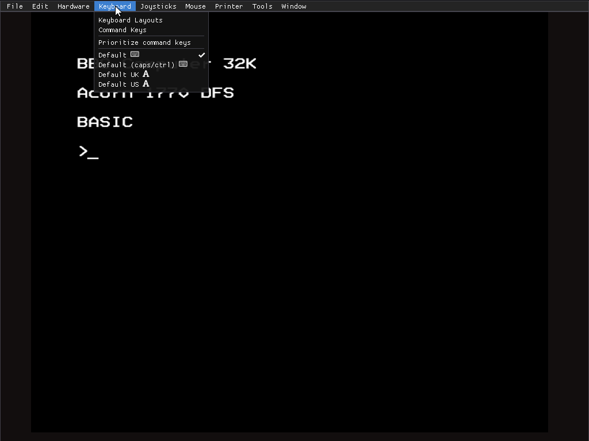
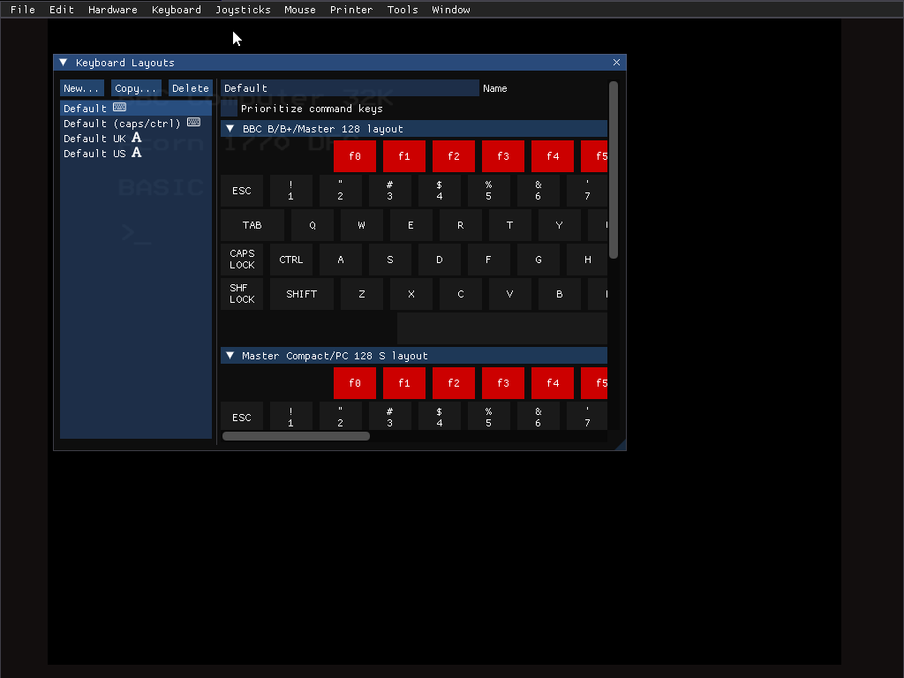
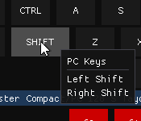
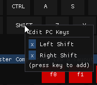
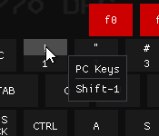

The BBC Micro keyboard layout is not quite the same as you'll find on
most modern systems!

IMAGE: BBC keyboard layout

By default, the mapping goes roughly by key position, so that it's
typically easy to play games, as per the following tables. ("UK Key"
is the key on an ordinary UK-type PC keyboard; "US Key", if different,
is the key on an ordinary US-type PC keyboard, or US-type Mac
keyboard.)

Using Shift gets you the shifted BBC version of the key: so shift+9
(say) will get you `)` (as per the BBC keyboard) rather than `(` (as
on the PC keyboard).

## BBC B/B+

| BBC Key    | UK Key                   | US Key |
|------------|--------------------------|--------|
| Number key | Corresponding number key |        |
| Letter key | Corresponding letter key |        |
| Escape     | Esc                      |        |
| Tab        | Tab                      |        |
| Caps Lock  | Caps Lock                |        |
| Ctrl       | Ctrl                     |        |
| Shift      | Shift                    |        |
| Return     | Enter                    |        |
| Cursor key | Corresponding cursor key |        |
| Copy       | End                      |        |
| Delete     | Backspace                |        |
| f1-f9      | f1-f9                    |        |
| f0         | f10                      |        |
| Break      | f11                      |        |
| ,          | ,                        |        |
| .          | .                        |        |
| /          | /                        |        |
| ;          | ;                        |        |
| :          | '                        |        |
| [          | [                        |        |
| ]          | ]                        |        |
| \-         | \-                       |        |
| _          | =                        |        |
| ^          | `                        |        |
| @          | #                        | \      |
| \          | \                        | Home   |

## Master 128

The Master 128 has some additional keys:

| Master 128 Key | UK/US Key |
|--------------------|--------------------|
| Num pad number key | Num pad number key |
| Num pad +          | Num pad +          |
| Num pad -          | Num pad -          |
| Num pad /          | Num pad /          |
| Num pad *          | Num pad *          |
| Num pad #          |                    |
| Num pad Delete     |                    |
| Num pad ,          |                    |
| Num pad Return     | Num pad enter      |
| Num pad .          | Num pad .          |

(Three of the keys are unmapped! Luckily the numeric keypad didn't
seem to get much use...)

## Master Compact/Olivetti PC 128 S

The Master Compact (and Olivetti PC 128 S) keyboard is the same as the
Master 128, with one exception: a special key, with 2 squares. This is
treated the same way as the `@` key:

| Master Compact key | UK key | US key |
|--------------------|--------|--------|
| Special key        | #      | \      |

## Electron

The Electron keyboard is a cut-down version of the BBC B/B+ keyboard:

| Electron Key   | UK/US Key                |
|----------------|--------------------------|
| Number key     | Corresponding number key |
| Letter key     | Corresponding letter key |
| Escape         | Esc                      |
| Func/Caps Lock | Caps Lock                |
| Ctrl           | Ctrl                     |
| Shift          | Shift                    |
| Return         | Enter                    |
| Cursor key     | Corresponding cursor key |
| Copy           | End                      |
| Delete         | Backspace                |
| Break          | f11                      |
| ,              | ,                        |
| .              | .                        |
| /              | /                        |
| ;              | ;                        |
| :              | '                        |
| \-             | \-                       |
| _              | =                        |

As with Shift, using Ctrl gets you the ctrled Electron version of the
key.

# Additional built-in keyboard layouts

There are three other keyboard layouts available by default. Find them on the `Keyboard` menu.

## `Default (caps/ctrl)`

This is very similar to the default layout, but with a slight tweak to
make it easier to play games that use some combination of Caps Lock,
Ctrl or A for movement.

Left Ctrl maps to BBC Caps Lock and Left Alt maps to BBC Ctrl, to
accommodate games that use Caps Lock and Ctrl.

Caps Lock maps to BBC Ctrl, to accommodate games that use Ctrl and A.

| BBC Key   | PC Key    |
|-----------|-----------|
| Caps Lock | Left Ctrl |
| Ctrl      | Left Alt  |
| Ctrl      | Caps Lock |

## `Default UK`

This layout works a bit differently, in that it goes by characters
rather than keys. (This is indicated by the little `A` marker by its
name.)

For example, if you press Shift+8, which would produce `*` on a modern
keyboard but `(` on the BBC, the emulator will pretend that you
pressed Shift+`:` on the BBC keyboard, thus producing `*` after all.

(The pretend keypresses are adjusted depending on the type of emulated
system.)

## `Default US`

Similar to Default UK, but for use with a US keyboard.

Use ` to type £.

# Design your own keyboard layout

Use `Keyboard` > `Keyboard Layouts` to bring up the Keyboard Layouts
dialog.

The list on the left lets you select the keyboard layout to edit. Edit
one of the existing ones, or use the `New...` and `Copy...` buttons to
create a new one. `New...` will create a new layout that's a copy of
one of the 4 built-in default ones, and `Copy...` will create a new
layout that's a copy of one of the (possibly modified) current ones.

Click `Delete` (a destructive action that needs confirmation) to
delete the currently selected layout. (Don't worry about deleting one
of the built-in layouts; you can always get it back with the `New...`
button.)

If the BBC display has focus, you'll see the current BBC key states
reflected in the Keyboard Layouts dialog as you type.

Click on the `Name` box at the top to edit the keymap's name.

Click `Prioritize command keys` to have keyboard shortcuts for the b2
UI take priority over BBC Micro input. (If you don't tick this, you
can still enable it later on an ad-hoc basis.)

The area on the right displays the keyboard layout for each type of
supported system: BBC B/B+/Master 128, Master Compact/Olivetti PC 128
S, and Electron. The separate layouts are provided for visual
reference, but the same key mappings apply to all 3 layouts.

For example, if you edit the `3` key in the BBC B/B+/Master 128
layout, that change will also apply to the `3` key for the Master
Compact/Olivetti PC 128 S layout, and the `3` key for the Electron
layout.

Note that not all layouts have the full set of keys. If you edit, say,
the Tab key in the BBC B/B+/Master 128 layout, that will apply to the
Tab key in Master Compact/Olivetti PC 128 S layout, but it will have
no effect on the Electron layout, as the Electron doesn't have a Tab
key.

## Edit keymaps keys

Hover over a key to see the PC keys that map to this one. When you
press one of the PC keys mentioned (any one), that BBC key will be
pressed.

Click on the key to edit the mapping. The PC keys popup will prompt
you to press a key to add it to the list. (The key-based keymaps deal
in individual keys only, so Shift, Ctrl, Alt, etc., are treated as
their own independent keys.) Alternatively, click the `x` button next
to a key's name to remove it from the list, or click outside the popup
to cancel editing this key.

## Edit character keymap keys

If you're looking at a character keymap, the process is rather
similar, but now each key is split into multiple parts, corresponding
to the various characters it can produce.

Click on a character to edit the mapping. The PC keys popup will
prompt you to press a key combination to add it to the list. (Here,
Shift, Ctrl and Alt are treated as modifiers, so you can have modified
and unmodified keypresses behave differently.)

As above, click `x` to remove a key from the list.

