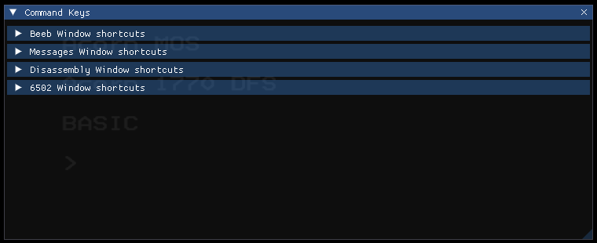
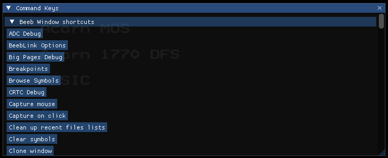
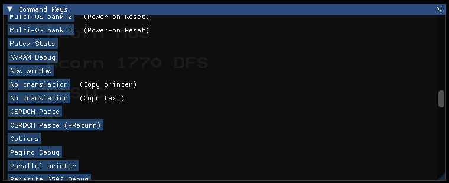
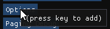
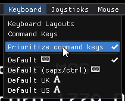

By default, pressing keys in b2 will send keypresses to the emulated
BBC Micro. For more about that aspect, see [the keyboard
documentation](./keyboard.md).

You do also have some options for having the keyboard control the b2
UI.

# Command keys

Use the Command Keys dialog to configure keyboard shortcuts for
actions in the b2 UI. Use `Keyboard` > `Command Keys` to show it.

The Command Keys dialog is divided into sections by window type. Click
on one of the headers to expand the section, showing commands that are
available when that type of window has keyboard focus. `Beeb Window`
refers to the main emulator window.

The name of each command is the same as that shown on its menu item or
button. If the name would be ambiguous, or if it's in a sub-menu,
extra text gives some indication of which specific command it refers
to.

To assign a shortcut, click the option. When the popup appears, press
the shortcut key combination you'd like to use, or click away from the
popup to cancel.

Once the shortcut is assigned, it'll appear in the list. Click the `x`
button to remove it.

# Focus

Shortcuts are processed if the window in question has keyboard focus.
For example, the shortucts under `Messages Window shortcuts` only
apply if the Messages window (`Tools` > `Messages`) is focused.

## `Beeb Window` shortcuts

As above, shortcuts in the `Beeb Window` section apply when the
emulated BBC Micro has focus, but with some specific special
behaviour: if the keys pressed would be a valid BBC Micro keys
(according to the current BBC keyboard layout), the combination will
always be treated as BBC Micro keypresses, and any shortcut behaviour
will be ignored.

This does make many useful shortcuts impossible to assign. For
example, Ctrl+Shift+O might be useful as a shortcut - but, by default,
that's also a valid BBC Micro key combination! So it'll always be
treated as pressing Ctrl+Shift+O on the BBC.

Use `Keyboard` > `Prioritize command keys` to change this.

When ticked, keys will be handled the other way round: if the keys
pressed make up a valid shortcut, that command will be run, and the
emulated BBC Micro won't see the final keypress.

(For shortcuts with multiple keys, the emulated BBC Micro will still
see the initial keypresses - as it's impossible to tell the
combination is a shortcut until the last key is pressed.)

If [setting up your own BBC Micro keyboard layout](./keyboard.md),
you can set the default setting for `Prioritize command keys` as part
of the keyboard layout.
