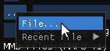

# MMFS

This documentation only relates to the b2-specific aspects of using
MMFS in b2. MMFS documentation can be found on its GitHub page:
https://github.com/hoglet67/MMFS/wiki

You can get the latest MMFS ROMs from [the MMFS release
page](https://github.com/hoglet67/MMFS/releases).

As per the MMFS documentation: there's two versions of MMFS, MMFSv1
and MMFSv2. They're both set up in quite similar ways, but you do have
to use the appropriate ROM in each case, and select the appropriate
type of file.

## MMFSv1

MMFSv1 works with `.mmb` files, which are containers for up to 511 DFS
disk image files, widely supported by a number of tools.

After enabling MMFS in the config, use the `...` > `File...` option to
select the `.mmb` file you want to use. (There is also a `Recent file`
submenu, for picking recently-selected MMFS files.)

You'll also need to install an MMFS ROM. Select a suitable ROM from
the `MMFS/M` folder in the release zip, according to the exact setup
of the emulated machine, as per this page:
https://github.com/hoglet67/MMFS/wiki/Release-structure

**Note that you must use a ROM from the `MMFS/M` folder.** If you use
MMFS on your real BBC Micro or Electron, you can't use the exact same
ROM for b2. Only ROMs from the `M` folder will work.

## MMFSv2

MMFSv2 works with FAT32 disk images containing individual DFS disk
images. 

After enabling MMFS in the config, use the `...` > `File...` option to
select the FAT32 disk image that you want to use. (There is also a
`Recent file` submenu, for picking recently-selected MMFS files.)

You'll also need to install an MMFS ROM. Select a suitable ROM from
the `MMFS2/M` folder in the release zip, according to the exact setup
of the emulated machine, as per this page:
https://github.com/hoglet67/MMFS/wiki/Release-structure

**Note that you must use a ROM from the `MMFS/M` folder.** If you use
MMFS on your real BBC Micro or Electron, you can't use the exact same
ROM for b2. Only ROMs from the `M` folder will work.
