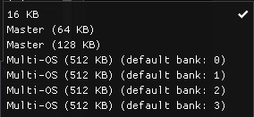
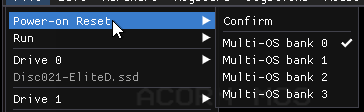

# OS ROM types

The set of possible OS ROM types depends on the model, as shown by the
`Model:` line in the Configs dialog.

## B, B+, Electron

These models only support one type of OS ROM image.

- `16 KB` - a ROM image, up to 16 KB

(The ROM image can be smaller than 16 KB, if required. It will be
loaded so that its last byte ends up at address $ffff.)

## Master 128, Master Compact

These models support multiple OS ROM image types.

- `16 KB` - a ROM image, up to 16 KB (see above note)
- `Master (64 KB)` - a 64 KB ROM image of the Master Compact or
  Olivetti PC 128 S ROM: OS, then sideways ROM banks D-F, in that
  order
- `Master (128 KB)` - a 128 KB ROM image of the Master 128 ROM: OS,
  then sideways ROM banks 9-F, in that order
- `Multi-OS (512 KB) (default bank: N)` - a 512 KB ROM image, 4
  `MegaROM (128 KB)` images, banks 0-3, in that order. There are 4
  options for this, depending on which image you'd like to have
  selected by default

For types other than `16 KB`, the ROM images cover some of the
sideways ROM banks as well. These sideways ROM banks will become
hidden in the UI, and any previous settings will be ignored (but they
won't be lost, should you decide to change the OS type back).

### Multi-OS bank selection

There are four `Multi-OS (512 KB)` options, corresponding to the bank
you'd like to have selected by default for the config.

To select another bank when using one of these configs, see `File` >
`Power-on reset`, which will have 4 entries that allow the bank to be
selected. (The currently selected bank's entry is ticked.)

The usual `Confirm` entry will do a power-on reset with the currently
selected bank.

