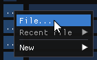
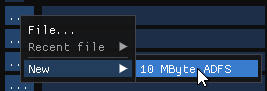

# Using existing SCSI hard disk images

The b2 hard disk file format is the same as that used by BeebEm and
B-em, so any existing files should hopefully work as-is.

BBC hard disk images usually come as two files: a `.dat` with the disk
contents, and a corresponding `.dsc` file defining the disk geometry.

Use the `...` > `File...` option for the hard disk of interest to
bring up a file selector.

Select the `.dat` file, and b2 will find the accompanying `.dsc` file
itself.

(If there's no corresponding `.dsc`, b2 will assume a disk geometry
that will probably work. You'll see a warning to alert you to this
case.)

# Creating new SCSI hard disk images

To create a new hard disk image, use `...` > `New` > `10 MByte ADFS`.

Use the file selector to select the name for a new preformatted 10
MByte ADFS hard disk image.

If 10 MBytes isn't enough, you can reformat it using the
`$.FORMAT.SUPERFORM` that comes supplied on the resulting disk - see
the Winchester Disc Filing System User Guide. Use the `C` option to
set the drive parameters. The total disk size will be roughly (heads *
cylinders * 33 - 135) * 256.

(The -135 is unimportant for any realistic hard disk size, but if
you're trying to create a tiny one then it might become noticeable.
Safest to pick at least 10 cylinders.)

Formatting can take a long time.

# Using IDE hard disk images

You can point b2 at an IDE hard disk image, and it'll assume it's a
SCSI disk image with a disk geometry that should hopefully work. (As
when selecting a SCSI image with no disk geometry file, you'll see a
warning to alert you of this.) This should let you copy files off the
disk, at least - or, at your own risk, you can use the disk image as
it is.

Note that you may find hard disk images that do work with IDE ADFS but
give a `Bad FS map` error with Acorn ADFS - some of the IDE ADFS ROMs
don't do the same checks as the standard ADFS. There's no current fix
for this; you may have better luck with a different emulator.
