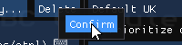
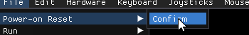
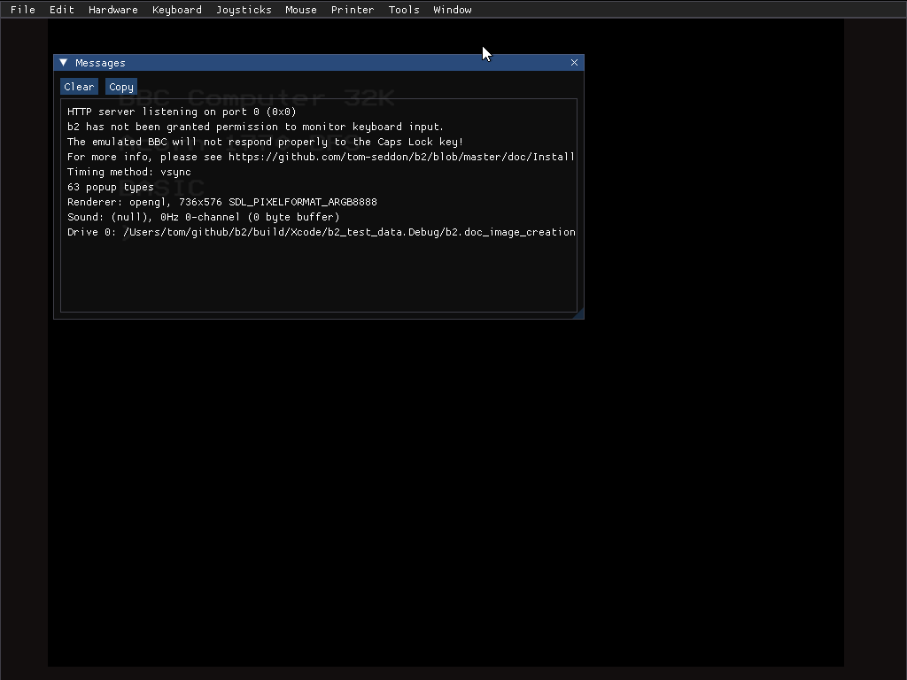
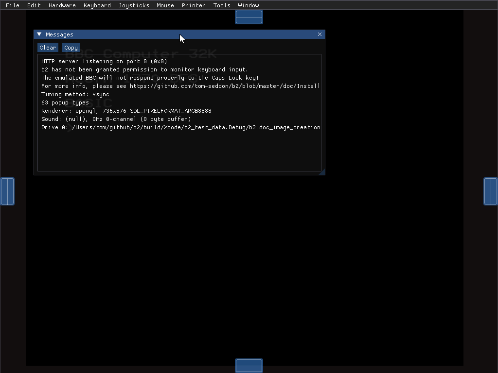

A few notes about b2's UI, which is not native on any platform. It
shouldn't prove too inexplicable, but it does have some idiosyncratic
aspects.

# Using macOS?

Like a Windows program, the b2 menu is part of the b2 window. The
macOS menu bar is largely redundant. Sorry!

# Confirm popups

There are no yes/no/ok/cancel-type dialogs in the b2 UI, that wait for
you to confirm a destructive action. To confirm this sort of action,
an additional `Confirm` submenu or popup menu will be shown, that
you'll have to click to confirm.

Click away from the popup if you decide not to go ahead with the
action.

# Popup messages

As you do stuff in b2, it may pop messages up briefly to serve as
feedback.

IMAGE: message popping up

If the message goes away quickly, the exact contents weren't that
important. To see the full list of messages printed, go to the `Tools`
menu and select `Messages`.

If an actual error pops up, the full messages dialog will pop up, and
won't go away.

Click `Copy` to copy the message list to the clipboard.

# Dialogs

To hide a dialog, click its `x` button.

Alternatively, select its menu option (e.g., `Tools` > `Messages`).
The tick next to the option indicates that the dialog is currently
visible.

Dialogs are never modal. The emulated BBC continues to run while
they're open, and you can still interact with other dialogs.

# Docking windows

All the dialogs are dockable. When moving a dialog by its title bar
inside the b2 window, note the docking prompts at the edges of the
window.

Drag the window onto one of the docking prompts to have it dock itself
to the edge of the b2 window. The emulated display will resize itself
to accommodate the change.

IMAGE: docked dialog

You can dock further dialogs to a corner of the b2 window at its new
size, or to corners of already docked dialogs. You can also dock a
dialog on top of a docked dialog: the area will grow a tab bar, to
allow you to switch between them.

IMAGE: docked+tabbed dialog
