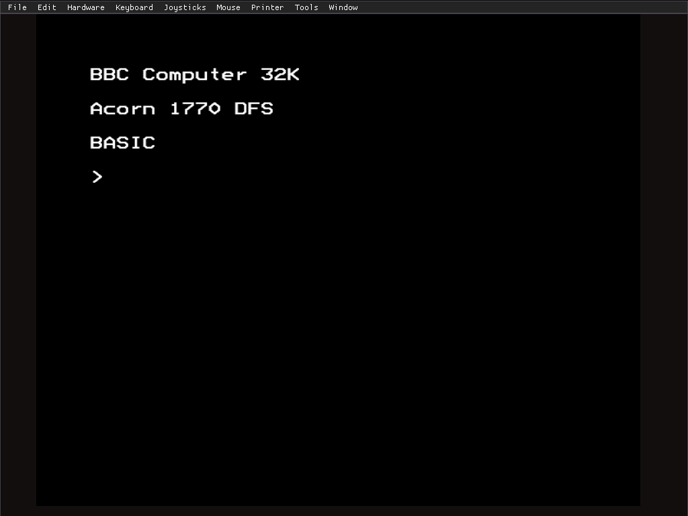
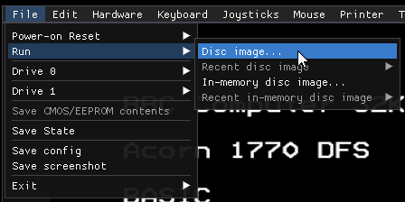
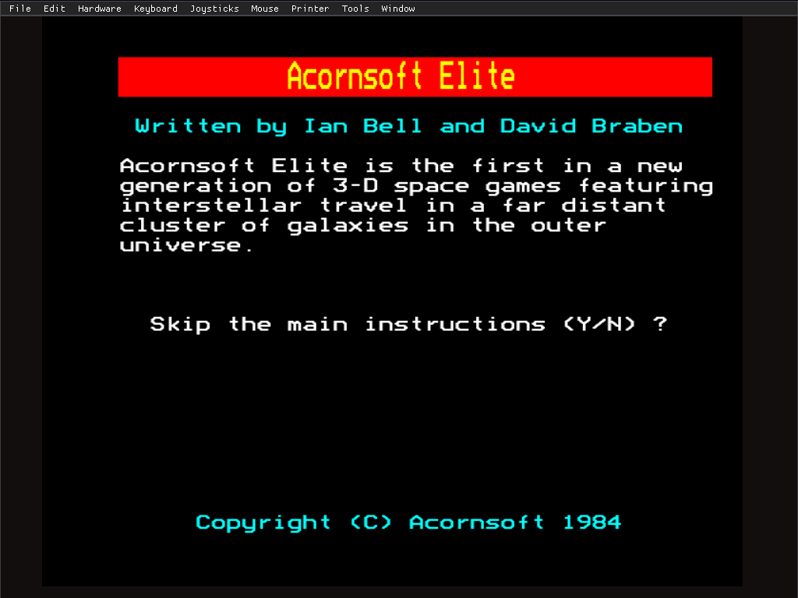
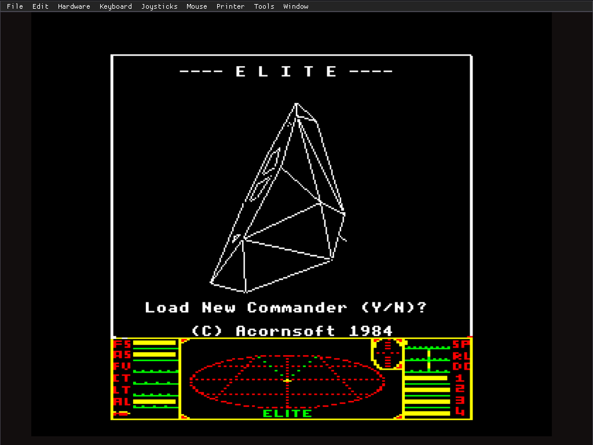
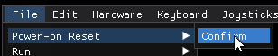
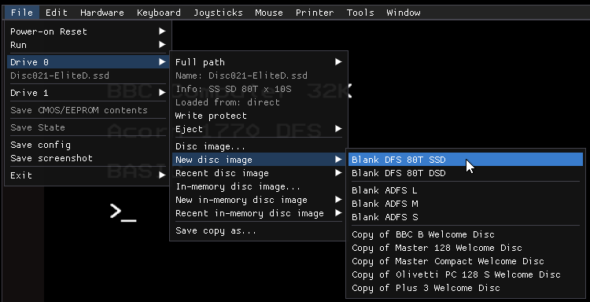
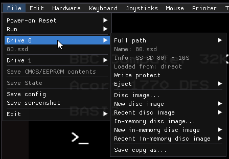
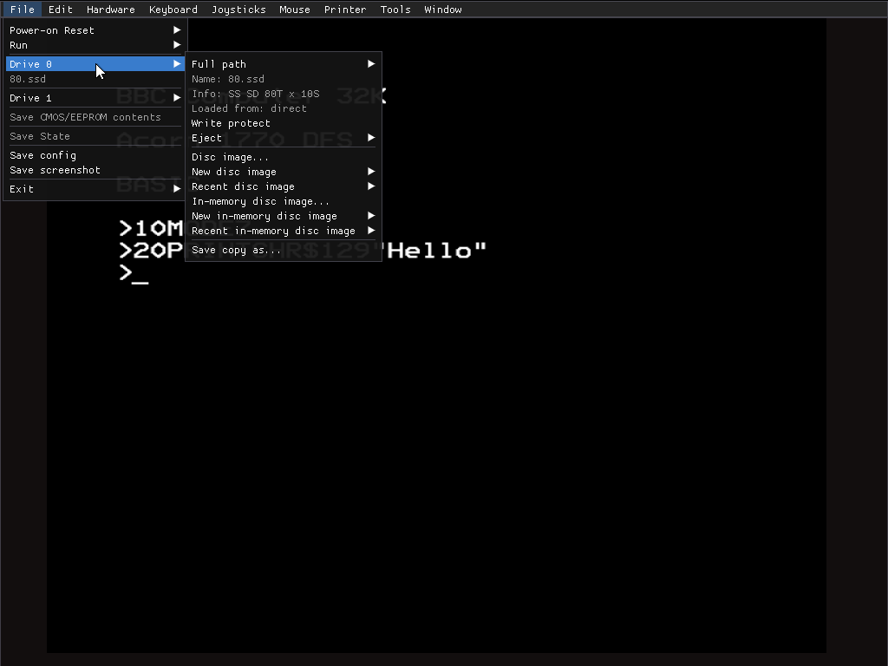
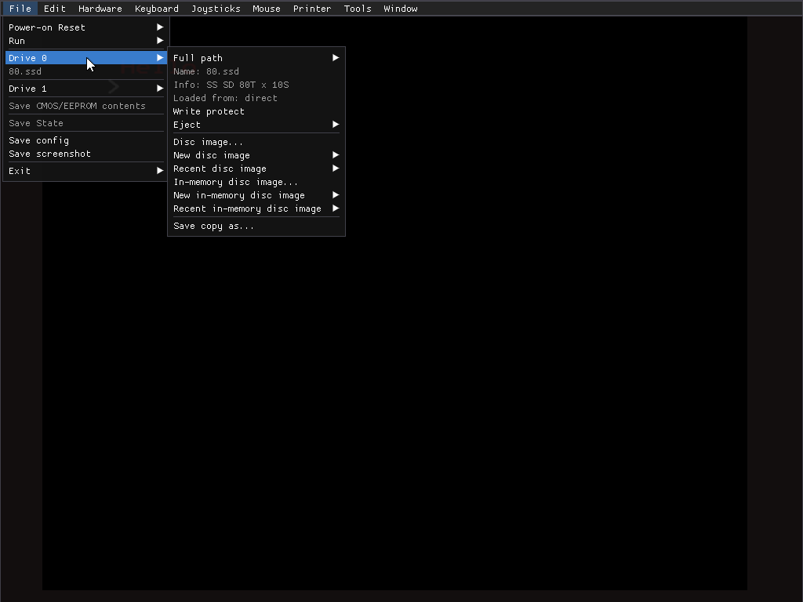
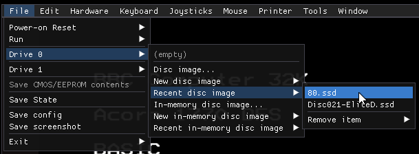

A walkthrough of some of b2's features. 

# First time startup

First time you run b2, you'll be presented with a typical BBC Micro
startup screen: `BBC Computer 32K`, `Acorn 1770 DFS`, `BASIC`.



There's also a little menu bar at the top, for accessing the
emulator's features.

# Running BBC games

BBC Micro games usually come as disk images, typically with a .ssd
extension. There's a near-complete collection to be found on
[https://bbcmicro.co.uk](https://bbcmicro.co.uk), with a search
facility (and also all playable in-browser using the
[jsbeeb](https://github.com/mattgodbolt/jsbeeb) emulator).

Elite is a well-known classic:
https://bbcmicro.co.uk/game.php?id=366 - click `Download` on its page
download a copy of the .ssd file for it.

Game disks are typically auto booting, and Elite is no exception. From
inside b2, via the menu bar, click `File` > `Run` > `Disc image...`,
and select the file you downloaded, probably called
`Disc021-EliteD.ssd`.



It'll start up and run automatically. The `bbcmicro.co.uk` version
starts up with some instruction screens.



Once you're past those, you'll be into the game proper.



(Something to note: the BBC Micro keyboard is slightly different from
a modern computer's. There's more about that in [the keyboard layout
documentation](./keyboard.md).)

# Writing BBC code

Get back to the original startup prompt by doing Ctrl+F11
(corresponding to Ctrl+Break on the BBC), or doing `File` > `Power-on
Reset` > `Confirm` from the menu.



First, create a blank disk for storing the code. Easiest way to do
this is from the UI: `File` > `Drive 0` > `New disc image` > `Blank
DFS 80T SSD`.



Choose a path for the new disk image from the resulting file selector.
Note that `File` > `Drive 0` reflects the new state. (Exact file name
shown will depend on the name you chose.)



Type in the following program. You can do it by hand - or, if you
prefer (and it would be quicker...), copy the text to the clipboard
and then do `Edit` > `OSRDCH Paste (+Return)`.

(If typing it by hand: to get a `"`, do Shift+2, and to get a `$`, do
Shift+4. This may or may not match the keys on your modern computer's
keyboard.)

```
10MODE7
20PRINTCHR$129"Hello"
```



Run it by typing `RUN` (and pressing Return). You should get the (not
very exciting) following output.



To save it, use the `SAVE` command. For example, `SAVE"TEST"`.


The data will be written to the .ssd file you chose, so that it'll be
available for future runs - and you can use the `Recent disc image`
submenu to load it quickly.

(Exact paths shown will be computer-specific.)


